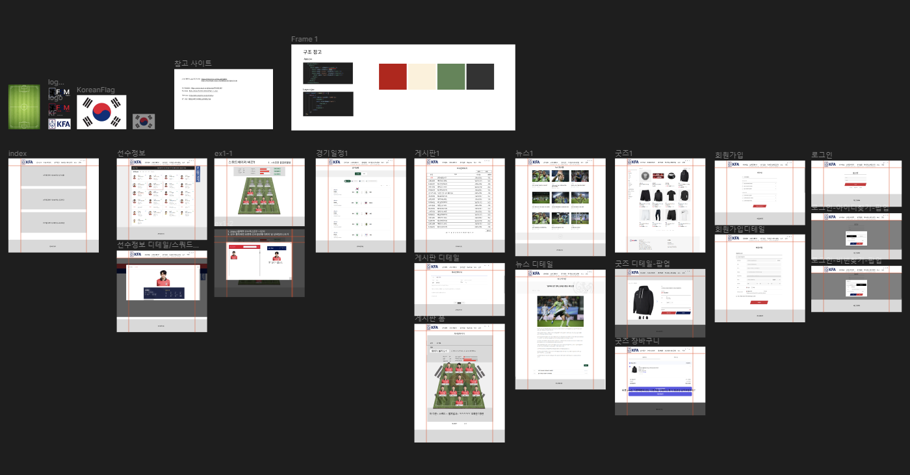
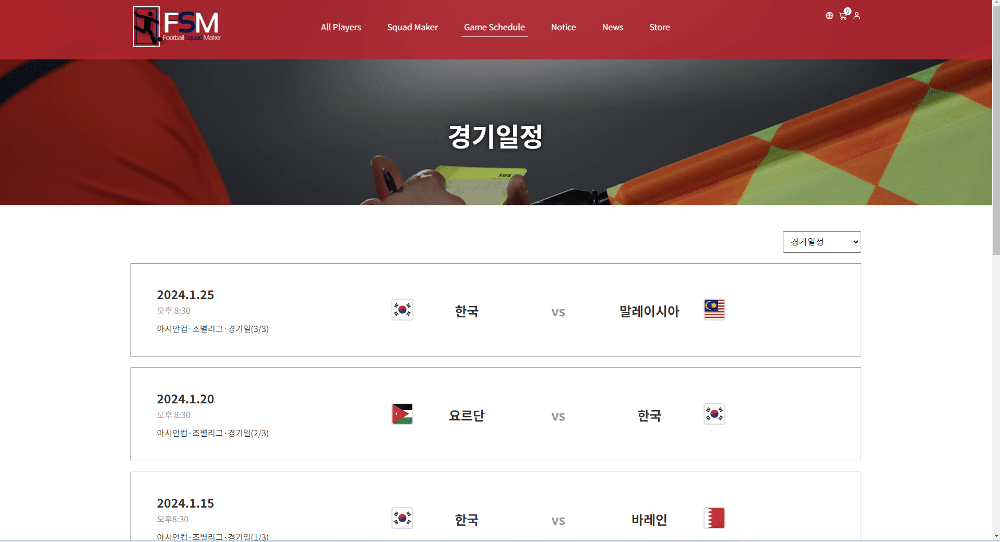
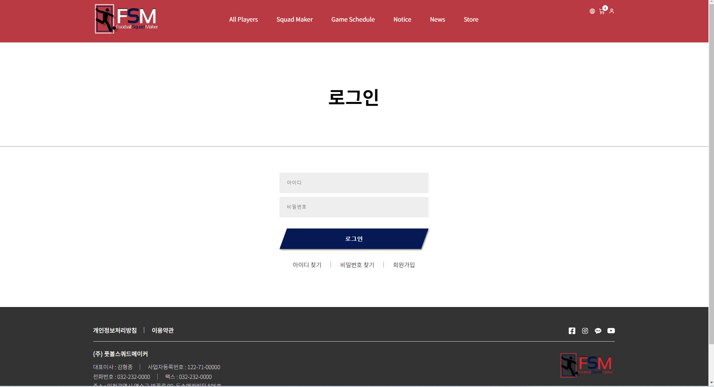

# 풋볼스쿼드메이커 홈페이지 제작 (팀작업)

## 팀원

|             | 이름   | Github                                  | 작업사항                                                                                                                                                                                                                                                                                                                             |
| :---------- | :----- | :-------------------------------------- | :----------------------------------------------------------------------------------------------------------------------------------------------------------------------------------------------------------------------------------------------------------------------------------------------------------------------------------- |
| FE          | 김하진 | [@HajinKimm](https://github.com/HajinKimm) | [메인]() [경기일정]() [게시판]() [로그인]()/[회원가입]() |
| FE          | 김형종 | [@Ocjji](https://github.com/Ocjji)         | [스쿼드메이커]() [굿즈]() [게시판 작성]()                                                                                                           |
| FE        | 이명관 | [@audrhks29](https://github.com/audrhks29) | [선수명단]() [선수명단추가]() [장바구니]()                 |

# 프로젝트 사이트

 
 

# 프로젝트 참고 사이트

1. <a href="https://www.kfa.or.kr/" target="_blank">대한축구협회</a>
2. <a href="https://fconline.nexon.com/datacenter/squadmaker/" target="_blank">FC ONLINE</a>

# 프로젝트 기술 스택

- [X] React JS (vite)
- [X] Styled-Components

## 프로젝트 작업 순서
1. 참고 페이지 선정
2. 페이지 리뉴얼 및 디자인 수정
3. React JS (vite) / Styled-Components

## Wireframe

# 프로젝트 기능 구현

### 1) 메인

* scroll 이동 시 header-fixed
* news 컨텐츠 최신 뉴스로 자동 변경
* 장바구니 수량 출력

### 2) 선수명단 / 선수명단 추가

* search box 구현
* 선수포지션 type 클릭 시 해당 내용 출력
* content 클릭 시 Popup창 열림
* 선수 추가 버튼 클릭시 페이지 이동
* 원하는 정보의 선수 추가 기능 구현
* 선수 정보 변경 및 삭제 기능 구현

### 3) 스쿼드메이커

* Squad 이미지 클릭 시 Popup창 열림
* 포지션에 맞는 content 출력
* 선수정보 확인 및 선수 선택 기능 구현
* 선택된 content 관련 내용 수치화 출력
* 제작한 Squad Maker 게시글 작성 기능 구현
* 게시글 작성 버튼 클릭시 페이지 이동

### 5) 경기일정

* 경기일정 년도에 따른 content 내용 변경
* page 번호 구현

### 6) 게시판

* search box 구현
* 글쓰기 시 '분류-자유게시판'의 글만 작성 구현
* 게시글 작성 시 현재날짜 자동 출력
* 게시글 확인시 조회수 변경

### 7) 뉴스

* search box 구현
* content 더보기 버튼 구현
* content 클릭시 상세 페이지로 이동
* 상세페이지 이전글, 다음글, 목록 버튼 구현

### 8) 굿즈 / 장바구니

* 상품 type 클릭 시 해당 내용 출력
* content 클릭 시 Popup창 열림
* 상품에 따라 다른 옵션선택 구현
* page 번호 구현
* 장바구니 목록에 따른 주문금액 변경

### 8) 로그인 / 회원가입

* 약관보기 페이지 열림/닫힘 구현
* 체크박스 전체동의 구현
